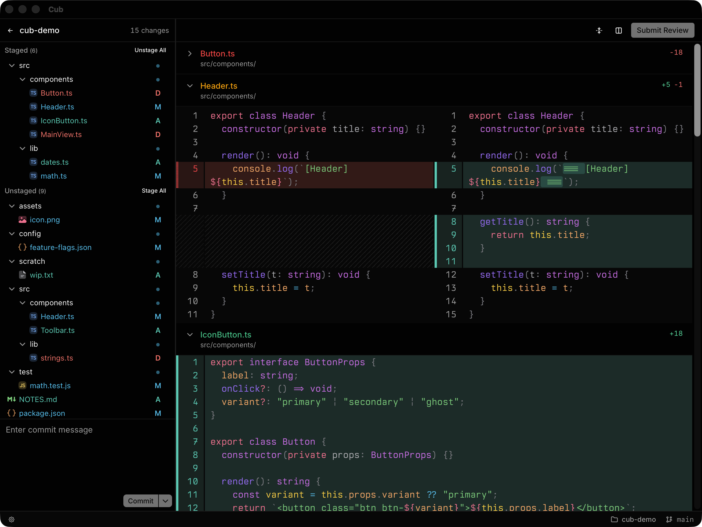

# Cub

**A simple git client with AI code review built in.**

<p align="center">
  
</p>

---

## What it is

Cub is a desktop git client. You stage, commit, switch branches, and discard changes the way you would in any other client.

The thing it does that other clients don't: you can review your AI-generated changes inline — leave comments on specific lines, classify them as change-requests, questions, or nits — and an MCP server hands those comments back to the agent so it can address them. No copy-pasting line numbers into chat.

## Install

**macOS** (Apple Silicon or Intel):

```bash
brew install --cask ephraimduncan/cub/cub
```

**Linux** — grab the matching artifact from [the latest release](https://github.com/ephraimduncan/cub.dev/releases/latest):

- `Cub_<version>_amd64.deb` for Debian / Ubuntu
- `Cub-<version>-1.x86_64.rpm` for Fedora / RHEL
- `Cub_<version>_amd64.AppImage` for everything else

Cub needs [Bun](https://bun.sh) at runtime for the MCP sidecar.

## CLI

```bash
cub                # launch with the folder picker
cub .              # launch pointed at the current repo
cub /path/to/repo  # launch pointed at a specific repo
cub --mcp          # MCP-only mode, no GUI (for agent configs)
```

## The loop

```
1. Agent writes a bunch of code.
2. You open Cub on the repo (`cub .`).
3. You browse the diff, leave inline comments
   (change-request / question / nit).
4. You hit "Submit review".
5. In your agent: "address the open review in Cub."
   The agent calls the MCP server, gets your comments,
   makes edits, and marks each one resolved or answered.
6. Cub auto-refreshes; you see what changed and what's left.
7. Stage and commit from Cub when you're happy.
```

## Features

**Git client**
- Stage, unstage, and discard files from the sidebar
- Commit with message + optional `--amend`
- Branch switcher in the status bar
- Recent repos and remembered last-opened repo
- Auto-refresh on disk changes

**AI code review**
- Inline comments on single lines or line ranges
- Classify each comment as change-request / question / nit
- Batched submission — all comments go out together as one review
- Live comment lifecycle: pending → acknowledged → resolved / dismissed, updated as the agent works
- MCP server so any MCP-aware agent (Claude Code, Cursor, etc.) can read and respond

**Quality of life**
- System / light / dark theme, persisted
- Diff editor font + size, persisted
- Auto-update

## Agent setup (MCP)

Cub ships a Node sidecar that exposes an MCP server over stdio. Wire it into your agent like any other MCP tool:

```json
{
  "mcpServers": {
    "cub": {
      "command": "cub",
      "args": ["--mcp"]
    }
  }
}
```

Tools exposed:

| Tool | Purpose |
|---|---|
| `watch_reviews` | Long-poll for new submitted reviews |
| `get_review` | Fetch the open review's comments (path, line range, text, action type) |
| `acknowledge_comment` | Mark a comment as in-progress |
| `resolve_comment` | Mark a comment as resolved, with an optional summary |
| `dismiss_comment` | Mark a comment as dismissed, with a reason |
| `resolve_review` | Close out the review when every comment is handled |

> **Note for agents handling `action_type=question`:** answer in the `summary` field of `resolve_comment`. Don't edit code unless the comment is a `change-request`.

## Building from source

Requires [Bun](https://bun.sh), the [Rust toolchain](https://rustup.rs), and the Tauri v2 [system dependencies](https://v2.tauri.app/start/prerequisites/).

```bash
git clone https://github.com/ephraimduncan/cub.dev
cd cub.dev
bun install
bun run tauri dev          # hot-reloading dev build
bun run tauri build        # production binary in src-tauri/target/release/bundle
```

## License

[MIT](LICENSE) © Ephraim Duncan
